# Nucleus — AI-Powered Nurse Station Monitoring System

> Hackathon Project · 5 hours · 4 people  
> Stack: Fetch.AI uAgents · Supabase (PostgreSQL + Realtime) · React · Claude API

---

## 1. Overview

VitalWatch is a real-time hospital floor monitoring system powered by a multi-agent architecture. Each patient room has a dedicated AI agent that continuously reads vitals, detects anomalies, and generates clinical recommendations. A floor-level aggregator agent collects signals from all patient agents, prioritizes them by severity, and pushes structured data to a nurse station dashboard in real time via Supabase Realtime.

The nurse on duty sees a live, ranked view of all patients — flagged risks surfaced to the top, AI-generated action suggestions, and a one-click doctor call queue.

---

## 2. Problem Statement

Nurses managing 8–15 patients simultaneously rely on periodic manual checks and fragmented monitor alerts. Critical deterioration events — sepsis onset, cardiac arrhythmia, hypoxia — can develop between check rounds. VitalWatch provides a centralized, AI-augmented view that continuously monitors all patients and surfaces the right information at the right time.

---

## 3. System Architecture

```
┌─────────────────────────────────────────────────────────┐
│                    BEDSIDE LAYER                        │
│                                                         │
│  [Patient Agent 201]  [Patient Agent 202]  [Agent N]   │
│   • Polls vitals        • Polls vitals                  │
│   • Detects anomaly     • Detects anomaly               │
│   • Generates flag      • Generates flag                │
│   • AI suggestion       • AI suggestion                 │
└──────────────┬──────────────────────────────────────────┘
               │  uAgents async messaging (ctx.send)
┌──────────────▼──────────────────────────────────────────┐
│                    FLOOR LAYER                          │
│                                                         │
│            [Floor Aggregator Agent]                     │
│   • Subscribes to all patient agents                    │
│   • Prioritizes by severity (Critical > Watch > Stable) │
│   • Writes aggregated state → Supabase                  │
│   • Manages doctor call queue                           │
└──────────────┬──────────────────────────────────────────┘
               │  Supabase Realtime (WebSocket)
┌──────────────▼──────────────────────────────────────────┐
│                    STATION LAYER                        │
│                                                         │
│   [Nurse Station Dashboard]    [Doctor Alert System]    │
│   React frontend               Triggered by flags       │
│   Live patient grid            Urgent / Routine queue   │
└─────────────────────────────────────────────────────────┘
```



### Agent Communication (Fetch.AI uAgents)

- Each **Patient Agent** runs on `@agent.on_interval(period=10.0)` — polling every 10 seconds.
- Agents communicate via `await ctx.send(FLOOR_AGENT_ADDRESS, VitalsUpdate(...))`.
- The **Floor Aggregator Agent** uses `@agent.on_message(model=VitalsUpdate)` to receive all patient updates.
- All agents are registered on the **Almanac contract** for discovery.
- The Floor Agent writes to Supabase after each aggregation cycle.

### Real-Time Dashboard (Supabase Realtime)

- The React dashboard subscribes to Supabase Realtime on the `patient_current_state` table.
- On each INSERT or UPDATE event, the dashboard re-renders the patient grid.
- Doctor call queue is managed via the `doctor_calls` table with its own Realtime channel.

---

## 4. Fetch.AI Agent Definitions

### 4.1 Patient Agent (one per room)

```python
from uagents import Agent, Context, Model
from supabase import create_client

class VitalsUpdate(Model):
    patient_id: str
    room: str
    hr: float           # Heart rate (bpm)
    bp_sys: float       # Systolic BP (mmHg)
    bp_dia: float       # Diastolic BP (mmHg)
    spo2: float         # Oxygen saturation (%)
    temp: float         # Temperature (°C)
    rr: float           # Respiratory rate (breaths/min)
    flag: str           # "critical" | "watch" | "stable"
    ai_note: str        # Claude-generated clinical note

patient_agent = Agent(
    name="patient_room_201",
    seed="room_201_seed_phrase",
    port=8001,
    endpoint=["http://localhost:8001/submit"],
)

FLOOR_AGENT_ADDRESS = "agent1q..."  # Floor agent address from Almanac

@patient_agent.on_interval(period=10.0)
async def monitor_vitals(ctx: Context):
    vitals = read_vitals_from_mock()        # or real machine API
    flag = evaluate_flag(vitals)
    note = call_claude_for_note(vitals)     # Claude API call
    await ctx.send(FLOOR_AGENT_ADDRESS, VitalsUpdate(
        patient_id="p-201",
        room="201",
        flag=flag,
        ai_note=note,
        **vitals
    ))
```

### 4.2 Flag Evaluation Logic

Based on clinical thresholds (see Section 6):

```python
def evaluate_flag(v: dict) -> str:
    critical = (
        v["hr"] > 120 or v["hr"] < 50 or
        v["spo2"] < 92 or
        v["bp_sys"] > 180 or v["bp_sys"] < 80 or
        v["temp"] > 39.5 or
        v["rr"] > 25 or v["rr"] < 10
    )
    watch = (
        v["hr"] > 100 or v["hr"] < 60 or
        v["spo2"] < 95 or
        v["bp_sys"] > 140 or
        v["temp"] > 38.0 or
        v["rr"] > 20
    )
    if critical:
        return "critical"
    if watch:
        return "watch"
    return "stable"
```

### 4.3 Floor Aggregator Agent

```python
floor_agent = Agent(
    name="floor_aggregator_3west",
    seed="floor_3west_seed",
    port=8100,
    endpoint=["http://localhost:8100/submit"],
)

@floor_agent.on_message(model=VitalsUpdate)
async def handle_patient_update(ctx: Context, sender: str, msg: VitalsUpdate):
    upsert_to_supabase(msg)          # Write to patient_current_state
    log_vitals_history(msg)          # Write to vitals_readings
    update_doctor_queue(msg)         # Manage doctor_calls table
```

---

## 5. Supabase Database Schema

### 5.1 Full SQL Schema

```sql
-- ============================================================
-- VITALWATCH SCHEMA
-- ============================================================

-- Hospitals and floors
CREATE TABLE hospitals (
  id          UUID PRIMARY KEY DEFAULT gen_random_uuid(),
  name        TEXT NOT NULL,
  created_at  TIMESTAMPTZ DEFAULT NOW()
);

CREATE TABLE floors (
  id           UUID PRIMARY KEY DEFAULT gen_random_uuid(),
  hospital_id  UUID REFERENCES hospitals(id),
  name         TEXT NOT NULL,       -- e.g. "Floor 3 West"
  wing         TEXT,                -- e.g. "ICU", "Cardiology"
  created_at   TIMESTAMPTZ DEFAULT NOW()
);

-- Patients
CREATE TABLE patients (
  id              UUID PRIMARY KEY DEFAULT gen_random_uuid(),
  floor_id        UUID REFERENCES floors(id),
  room_number     TEXT NOT NULL,
  full_name       TEXT NOT NULL,
  date_of_birth   DATE,
  sex             TEXT CHECK (sex IN ('M', 'F', 'Other')),
  weight_kg       NUMERIC(5,1),
  primary_dx      TEXT,             -- Primary diagnosis
  admission_date  DATE DEFAULT CURRENT_DATE,
  attending_doc   TEXT,
  status          TEXT DEFAULT 'admitted'
                  CHECK (status IN ('admitted', 'discharged', 'transferred')),
  notes           TEXT,
  created_at      TIMESTAMPTZ DEFAULT NOW()
);

-- Live state (one row per patient, upserted by floor agent)
-- Realtime is enabled on this table
CREATE TABLE patient_current_state (
  patient_id    UUID PRIMARY KEY REFERENCES patients(id),
  hr            NUMERIC(5,1),       -- Heart rate (bpm)
  bp_sys        NUMERIC(5,1),       -- Systolic BP (mmHg)
  bp_dia        NUMERIC(5,1),       -- Diastolic BP (mmHg)
  spo2          NUMERIC(4,1),       -- O2 saturation (%)
  temp_c        NUMERIC(4,1),       -- Temperature (°C)
  rr            NUMERIC(4,1),       -- Respiratory rate (breaths/min)
  flag          TEXT NOT NULL DEFAULT 'stable'
                CHECK (flag IN ('critical', 'watch', 'stable')),
  ai_note       TEXT,               -- Claude-generated note
  agent_address TEXT,               -- uAgent address for this patient
  last_updated  TIMESTAMPTZ DEFAULT NOW()
);

-- Vitals history (append-only, written every poll cycle)
CREATE TABLE vitals_readings (
  id          UUID PRIMARY KEY DEFAULT gen_random_uuid(),
  patient_id  UUID REFERENCES patients(id),
  hr          NUMERIC(5,1),
  bp_sys      NUMERIC(5,1),
  bp_dia      NUMERIC(5,1),
  spo2        NUMERIC(4,1),
  temp_c      NUMERIC(4,1),
  rr          NUMERIC(4,1),
  flag        TEXT CHECK (flag IN ('critical', 'watch', 'stable')),
  recorded_at TIMESTAMPTZ DEFAULT NOW()
);

-- Flags and alerts log
CREATE TABLE flags (
  id            UUID PRIMARY KEY DEFAULT gen_random_uuid(),
  patient_id    UUID REFERENCES patients(id),
  flag_type     TEXT NOT NULL
                CHECK (flag_type IN ('critical', 'watch', 'medication', 'trend', 'ai_suggestion')),
  severity      INTEGER CHECK (severity BETWEEN 1 AND 5),
  message       TEXT NOT NULL,
  ai_note       TEXT,
  acknowledged  BOOLEAN DEFAULT FALSE,
  ack_by        TEXT,               -- Nurse who acknowledged
  ack_at        TIMESTAMPTZ,
  resolved      BOOLEAN DEFAULT FALSE,
  created_at    TIMESTAMPTZ DEFAULT NOW()
);

-- Doctor call queue
CREATE TABLE doctor_calls (
  id            UUID PRIMARY KEY DEFAULT gen_random_uuid(),
  patient_id    UUID REFERENCES patients(id),
  doctor_name   TEXT NOT NULL,
  specialty     TEXT,
  urgency       TEXT NOT NULL
                CHECK (urgency IN ('urgent', 'routine', 'follow_up')),
  reason        TEXT,
  status        TEXT DEFAULT 'pending'
                CHECK (status IN ('pending', 'notified', 'in_progress', 'completed', 'cancelled')),
  scheduled_at  TIMESTAMPTZ,
  completed_at  TIMESTAMPTZ,
  created_at    TIMESTAMPTZ DEFAULT NOW()
);

-- Staff (nurses and doctors for the floor)
CREATE TABLE staff (
  id          UUID PRIMARY KEY DEFAULT gen_random_uuid(),
  floor_id    UUID REFERENCES floors(id),
  full_name   TEXT NOT NULL,
  role        TEXT CHECK (role IN ('nurse', 'doctor', 'head_nurse', 'resident')),
  specialty   TEXT,
  on_duty     BOOLEAN DEFAULT TRUE,
  created_at  TIMESTAMPTZ DEFAULT NOW()
);

-- ============================================================
-- INDEXES
-- ============================================================

CREATE INDEX idx_vitals_patient_time
  ON vitals_readings (patient_id, recorded_at DESC);

CREATE INDEX idx_flags_patient_unresolved
  ON flags (patient_id, resolved, created_at DESC);

CREATE INDEX idx_doctor_calls_status
  ON doctor_calls (status, urgency, created_at);

CREATE INDEX idx_current_state_flag
  ON patient_current_state (flag);

-- ============================================================
-- REALTIME — enable on live tables only
-- ============================================================

ALTER PUBLICATION supabase_realtime
  ADD TABLE patient_current_state, flags, doctor_calls;

-- ============================================================
-- SEED DATA — Floor 3 West demo
-- ============================================================

INSERT INTO hospitals (id, name) VALUES
  ('11111111-0000-0000-0000-000000000001', 'City General Hospital');

INSERT INTO floors (id, hospital_id, name, wing) VALUES
  ('22222222-0000-0000-0000-000000000001',
   '11111111-0000-0000-0000-000000000001',
   'Floor 3 West', 'General Medicine');

INSERT INTO patients
  (id, floor_id, room_number, full_name, date_of_birth, sex,
   weight_kg, primary_dx, attending_doc) VALUES
  ('aaaaaaaa-0000-0000-0000-000000000001',
   '22222222-0000-0000-0000-000000000001',
   '301', 'Maria Gonzalez', '1957-03-14', 'F',
   72.0, 'Post-op abdominal surgery', 'Dr. Patel'),
  ('aaaaaaaa-0000-0000-0000-000000000002',
   '22222222-0000-0000-0000-000000000001',
   '302', 'Lin Yao', '1983-07-22', 'F',
   58.5, 'Community-acquired pneumonia', 'Dr. Patel'),
  ('aaaaaaaa-0000-0000-0000-000000000003',
   '22222222-0000-0000-0000-000000000001',
   '303', 'David Mehta', '1995-11-09', 'M',
   80.0, 'Appendectomy (day 1 post-op)', 'Dr. Singh'),
  ('aaaaaaaa-0000-0000-0000-000000000004',
   '22222222-0000-0000-0000-000000000001',
   '305', 'James Okafor', '1970-01-30', 'M',
   90.0, 'Cardiac observation — bradycardia', 'Dr. Reyes');

INSERT INTO patient_current_state
  (patient_id, hr, bp_sys, bp_dia, spo2, temp_c, rr, flag, ai_note) VALUES
  ('aaaaaaaa-0000-0000-0000-000000000001',
   128, 158, 94, 97.0, 38.9, 22, 'critical',
   'HR elevated 22 min, trending up. BP above threshold. Possible sepsis onset. Recommend calling attending immediately.'),
  ('aaaaaaaa-0000-0000-0000-000000000002',
   88, 122, 78, 93.0, 37.9, 19, 'watch',
   'SpO2 borderline. Temp mildly elevated. Stable trend for 40 min. Continue monitoring q10min.'),
  ('aaaaaaaa-0000-0000-0000-000000000003',
   72, 118, 74, 99.0, 36.6, 15, 'stable',
   'All vitals within range for 3h. Next medication: amoxicillin at 14:30.'),
  ('aaaaaaaa-0000-0000-0000-000000000004',
   44, 110, 70, 91.0, 36.8, 16, 'critical',
   'Bradycardia detected. SpO2 dropped 4pt in 8 min. ECG shows irregular pattern. Immediate cardiology review required.');
```

---

## 6. Clinical Thresholds Reference

These thresholds inform the Patient Agent's `evaluate_flag()` function.  
Source: standard adult clinical reference ranges.

| Vital Sign | Normal (Adult) | Watch | Critical |
|---|---|---|---|
| Heart rate (HR) | 60–100 bpm | <60 or >100 | <50 or >120 |
| Systolic BP | 90–120 mmHg | >140 or <90 | >180 or <80 |
| Diastolic BP | 60–80 mmHg | >90 | >110 |
| SpO₂ | 95–100% | 92–94% | <92% |
| Temperature | 36.1–37.2°C | 37.3–38.5°C | >39.5°C or <35°C |
| Respiratory rate (RR) | 12–20 breaths/min | >20 or <12 | >25 or <10 |

**Early Warning Score logic:** If two or more "Watch" indicators trigger simultaneously, the agent escalates to `critical` regardless of individual thresholds.

---

## 7. Claude API Integration (AI Notes)

Each Patient Agent calls the Claude API once per polling cycle when a flag changes state or on every critical reading.

```python
import anthropic

def call_claude_for_note(vitals: dict, flag: str) -> str:
    client = anthropic.Anthropic()
    prompt = f"""
You are a clinical decision support AI assisting nurses.
Analyze these vitals for a hospitalized adult patient and write a
concise 1–2 sentence clinical note for the nurse, including a
suggested action if the status is watch or critical.

Vitals:
- Heart rate: {vitals['hr']} bpm
- Blood pressure: {vitals['bp_sys']}/{vitals['bp_dia']} mmHg
- SpO2: {vitals['spo2']}%
- Temperature: {vitals['temp_c']}°C
- Respiratory rate: {vitals['rr']} breaths/min
- Current flag: {flag}

Write the note as a single brief clinical observation (max 40 words).
Do not use the patient's name. Use clinical shorthand.
    """
    message = client.messages.create(
        model="claude-sonnet-4-20250514",
        max_tokens=100,
        messages=[{"role": "user", "content": prompt}]
    )
    return message.content[0].text
```

---

## 8. Tech Stack Summary

| Layer | Technology | Purpose |
|---|---|---|
| Agent framework | Fetch.AI uAgents 0.23+ | Patient agents, floor aggregator, messaging |
| Agent hosting | Agentverse (Mailbox) | Keep agents reachable without fixed IPs |
| Database | Supabase (PostgreSQL) | Persistent storage, schema, RLS |
| Realtime | Supabase Realtime | Push updates to dashboard via WebSocket |
| AI notes | Claude API (Sonnet) | Clinical note generation per vitals cycle |
| Frontend | React + Supabase JS client | Nurse station dashboard |
| Mock data | Python random + seed | Simulate vitals changes for demo |

---

## 9. Folder Structure

```
vitalwatch/
├── agents/
│   ├── patient_agent.py          # Template — one instance per room
│   ├── floor_aggregator.py       # Floor-level aggregator agent
│   ├── thresholds.py             # Flag evaluation logic
│   ├── claude_notes.py           # Claude API helper
│   └── mock_vitals.py            # Simulated vitals data generator
├── supabase/
│   ├── schema.sql                # Full DB schema (this file)
│   └── seed.sql                  # Demo data
├── dashboard/
│   ├── src/
│   │   ├── App.jsx
│   │   ├── components/
│   │   │   ├── PatientGrid.jsx   # Main patient cards grid
│   │   │   ├── PatientCard.jsx   # Individual patient card
│   │   │   ├── FlagBadge.jsx     # Critical / Watch / Stable badge
│   │   │   ├── DoctorQueue.jsx   # Doctor call queue panel
│   │   │   └── SummaryBar.jsx    # Top stats bar
│   │   └── lib/
│   │       └── supabase.js       # Supabase client + realtime hooks
├── .env.example
└── README.md
```

---

## 10. Environment Variables

```env
# Fetch.AI
AGENTVERSE_API_KEY=your_agentverse_api_key
FLOOR_AGENT_ADDRESS=agent1q...

# Supabase
SUPABASE_URL=https://your-project.supabase.co
SUPABASE_ANON_KEY=your_anon_key
SUPABASE_SERVICE_KEY=your_service_role_key   # agents use this

# Claude
ANTHROPIC_API_KEY=your_anthropic_key
```

---

## 11. Work Division (5 hours · 4 people)

### Person 1 — Agent Infrastructure Lead
**Goal:** Build and run all three agents end-to-end with mock data.

| Time | Task |
|---|---|
| 0:00–0:30 | Set up Python env, install `uagents`, scaffold project folder |
| 0:30–1:15 | Build `mock_vitals.py` — generate realistic, randomized vital sign streams per room |
| 1:15–2:15 | Build `patient_agent.py` — interval polling, flag evaluation, send to floor agent |
| 2:15–3:00 | Build `floor_aggregator.py` — receive messages, aggregate state |
| 3:00–3:30 | Register agents on Agentverse via Mailbox, test inter-agent messaging |
| 3:30–5:00 | Support integration: ensure Supabase writes work, demo run, bug fixes |

**Deliverable:** 4 patient agents + 1 floor agent running, messaging confirmed, mock vitals flowing.

---

### Person 2 — AI & Backend Logic
**Goal:** Claude API integration + Supabase write logic inside agents.

| Time | Task |
|---|---|
| 0:00–0:30 | Set up Supabase project, paste schema.sql, run seed.sql |
| 0:30–1:15 | Build `claude_notes.py` — API call, prompt, response parsing |
| 1:15–2:00 | Build `thresholds.py` — flag logic, early warning scoring |
| 2:00–3:00 | Build Supabase write functions (upsert `patient_current_state`, insert `vitals_readings`, insert `flags`) |
| 3:00–3:30 | Test full patient agent cycle: vitals → flag → Claude note → Supabase write |
| 3:30–5:00 | Tune Claude prompt for conciseness, add doctor call queue logic, bug fixes |

**Deliverable:** Every agent cycle results in a correct Supabase row write + AI note in the DB.

---

### Person 3 — Dashboard Core
**Goal:** React dashboard showing live patient grid with Realtime updates.

| Time | Task |
|---|---|
| 0:00–0:30 | Scaffold React app (`create vite@latest`), install Supabase JS client |
| 0:30–1:30 | Build `supabase.js` — client init + Realtime subscription hook on `patient_current_state` |
| 1:30–2:30 | Build `PatientCard.jsx` — vitals display, flag color coding, AI note, acknowledge button |
| 2:30–3:15 | Build `PatientGrid.jsx` — sorted by flag severity (critical first), summary stat bar |
| 3:15–4:00 | Wire Realtime: confirm live updates when Supabase row changes |
| 4:00–5:00 | Polish layout, test with live agent data, handle edge cases (no data, loading state) |

**Deliverable:** Running dashboard at `localhost:5173` showing live-updating patient cards.

---

### Person 4 — Doctor Queue & Demo Polish
**Goal:** Doctor call queue UI + end-to-end demo preparation.

| Time | Task |
|---|---|
| 0:00–0:45 | Build `DoctorQueue.jsx` — list pending calls, urgency badges, status updates |
| 0:45–1:30 | Wire doctor queue Realtime subscription from `doctor_calls` table |
| 1:30–2:30 | Add flag acknowledgement flow — button on PatientCard writes ack to Supabase `flags` table |
| 2:30–3:30 | Build demo script: pick 2 "dramatic" scenarios (sepsis onset, bradycardia), tune mock data to trigger them clearly |
| 3:30–4:15 | Write `README.md` — setup instructions, demo steps |
| 4:15–5:00 | End-to-end rehearsal, screenshots for slides, help debug integration issues |

**Deliverable:** Working doctor queue, acknowledged flags, demo script, README.

---

## 12. Integration Checkpoints

| Time | Milestone | Owner |
|---|---|---|
| T+1:30 | Mock vitals flowing from patient agent to console | P1 |
| T+2:00 | Supabase `patient_current_state` table receiving writes | P2 |
| T+2:30 | Dashboard displaying static Supabase data | P3 |
| T+3:00 | Full chain: agent → Supabase → Realtime → dashboard live update | P1+P2+P3 |
| T+3:30 | Critical flag → AI note → flag card on dashboard | P2+P3 |
| T+4:00 | Doctor queue visible and reactive | P4 |
| T+4:30 | End-to-end demo rehearsal | All |
| T+5:00 | 🎤 Demo |

---

## 13. Demo Flow (5-minute script)

1. Open the dashboard — 4 patients visible, all stable.
2. Trigger sepsis scenario for Room 301 (modify mock data seed to push HR → 128, temp → 38.9°C).
3. Show the Patient Agent detecting the threshold breach in the terminal.
4. Show the Floor Aggregator receiving the message and writing to Supabase.
5. Watch the dashboard card for Room 301 flip to **Critical** in real time.
6. Read the Claude-generated AI note aloud: *"HR elevated and trending up. BP above threshold. Possible sepsis onset. Recommend calling attending immediately."*
7. Click "Call Doctor" → entry appears in the doctor queue.
8. Trigger bradycardia scenario for Room 305 (HR → 44, SpO₂ → 91%).
9. Both critical cards are now at the top of the grid, stable patients pushed down.
10. Conclude: "One nurse, 4 patients, zero missed events."

---

## 14. MVP Scope vs. Stretch Goals

### MVP (must ship in 5h)
- Patient agents with mock data, flag evaluation, Claude notes
- Floor aggregator writing to Supabase
- Dashboard with live Realtime updates
- Doctor call queue
- 2 demo scenarios

### Stretch goals (if time allows)
- Trend graph per patient (Chart.js, last 20 readings from `vitals_readings`)
- Medication reminder agent (separate uAgent, reads medication schedule)
- Acknowledge flow with nurse name capture
- Multi-floor selector in dashboard
- EWS (Early Warning Score) composite display
